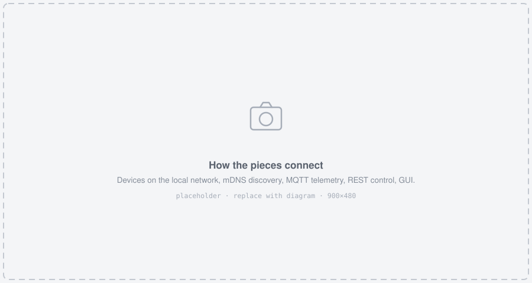

# Modules and repositories {#modules}

The DWARPH project is split into several interconnected components.
The [DWARPHs GitHub organisation](`r GITHUB_ORG_URL`) hosts the material (source code, schedules, CAD files, analysis) for each of them.

```{r, echo=FALSE}
df <- tibble::tribble(
  ~Name, ~Status, ~Description,
  "DWARPH-firmware", "available", "ESP-IDF firmware running on the ESP32-S3 device: scheduling, temperature and light control, camera, REST API and MQTT",
  "DWARPH-GUI", "available", "Python desktop dashboard that discovers devices on the network and drives them",
  "DWARPH-ml", "planned", "Machine learning for growth analysis and phenotype extraction from the time-lapse images",
  "DWARPH-manuscript", "planned", "Manuscript material and experiments for the method publication",
  "DWARPHs.github.io", "available", "Source code of this documentation"
)
knitr::kable(df)
```

## How the parts fit together {#architecture}

```{r architecture, echo=FALSE, fig.cap="How the pieces connect. *(placeholder diagram)*"}

```

A DWARPH deployment has two halves: any number of **devices**, and one **operator workstation** running the GUI. There is no central server and no cloud component; everything happens on the local network.

* Each **device** boots, joins the WiFi network named in its schedule, and starts executing that schedule autonomously. It keeps running whether or not anyone is watching — images and logs accumulate on its SD card.
* Each device **announces itself** over mDNS/ZeroConf, under a service name containing `dwarph`.
* Each device **publishes telemetry** to an MQTT broker once per second, and **serves a REST API** over HTTP.
* The **GUI** discovers devices by mDNS, subscribes to their MQTT topics for the live view, and uses REST for anything that needs a request/response exchange: fetching images, uploading a new schedule, starting and stopping the scheduler, streaming video, updating firmware.

The split matters in practice: MQTT carries the fast, lossy, broadcast-style state that a dashboard needs (temperature, setpoint, heater output), while REST carries the deliberate operations. A device with no broker configured still works fully over REST; MQTT is optional.

## The device firmware {#firmware}

`DWARPH-firmware` is an [ESP-IDF](https://docs.espressif.com/projects/esp-idf/en/stable/esp32/get-started/index.html) project targeting the ESP32-S3. Its main responsibilities:

* **Scheduler** (`main/scheduler`) --- parses `schedule.json`, and interpolates between setpoints to produce the temperature and light target for the current moment. This is the component that turns a static configuration file into a running experiment; it is documented in Chapter \@ref(manual).
* **Heater controller and PID** (`main/heater_controller.h`, `main/PID`) --- regulates the heating ring against the scheduled temperature. Setpoints are clamped to 10--50 °C in firmware as a safety measure.
* **Light controller** (`main/light_contoroller.hpp`, `main/led_board`) --- drives the red, blue and white channels, each on a 0.0--1.0 scale.
* **Camera** (`main/camera.h`, `main/camera_pins.h`) --- time-lapse capture at the configured interval, with a selectable focus mode. Uses a modified OV5640 autofocus driver alongside the Espressif camera component.
* **REST API** (`main/api`) --- see Section \@ref(rest-api).
* **Storage and logging** (`main/sd_card.h`, `main/logger_task`) --- images and logs are written to an SD card, under a per-device folder named after the device ID.
* **Supporting services** --- WiFi (`main/wifi_handler.h`), RTC and NTP time synchronisation (`main/RTC`, `main/time_functions.h`), an OLED status display (`main/96OLED4PINIIC.h`), and boot diagnostics.

## The GUI {#gui}

`DWARPH-GUI` is a Python/Tkinter application that turns a network of devices into a single dashboard.

* `discovery.py` --- ZeroConf discovery and device record tracking
* `mqtt_service.py` --- MQTT connection, subscription and queueing
* `http_client.py` --- REST request helpers
* `dashboard_controller.py` --- orchestrates discovery and MQTT processing
* `state_store.py` --- central device/detail state store the UI binds to
* `device_card.py` --- the per-device card widget
* `device_detail_window.py` --- per-device detail, actions and API console
* `app.py` --- application shell and window composition

What it gives an operator is covered in Chapter \@ref(manual).

## Machine learning {#ml-module}

*Planned --- this repository does not exist yet.*

The purpose of the imaging is ultimately quantitative: turning a time-lapse of a growth chamber into per-frame measurements of the duckweed population, such as covered area, frond count and growth rate, and relating those to the environmental conditions the device recorded alongside them.
`DWARPH-ml` is intended to hold that analysis code and the trained models.

## Manuscript {#manuscript-module}

*Planned --- this repository does not exist yet.*

`DWARPH-manuscript` is intended to hold the material and experiments for the method publication describing the platform, following the same pattern as the rest of the project: the analysis that produces the figures lives in the open, next to the code it describes.
