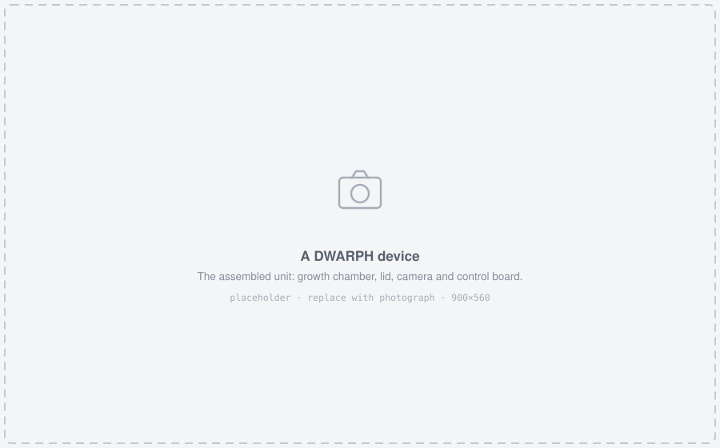
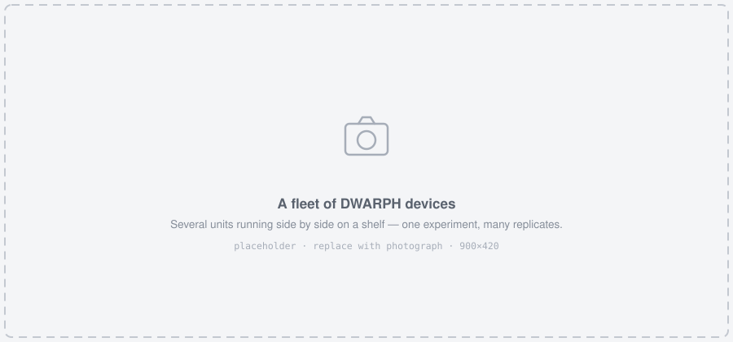
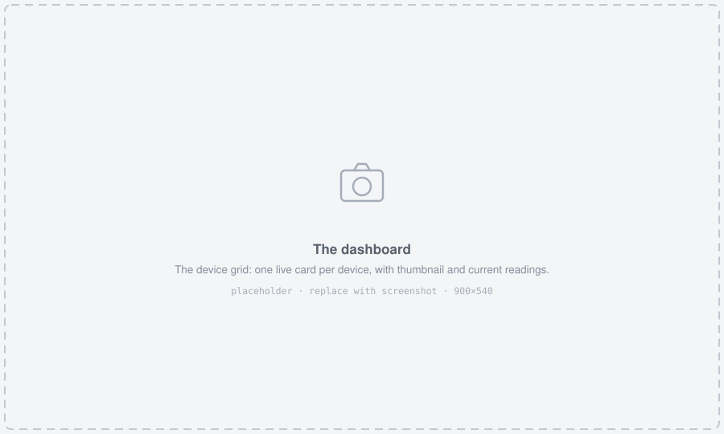
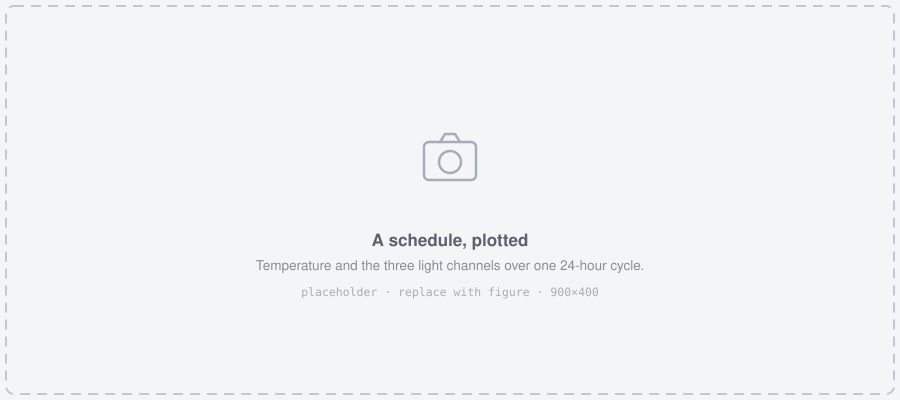
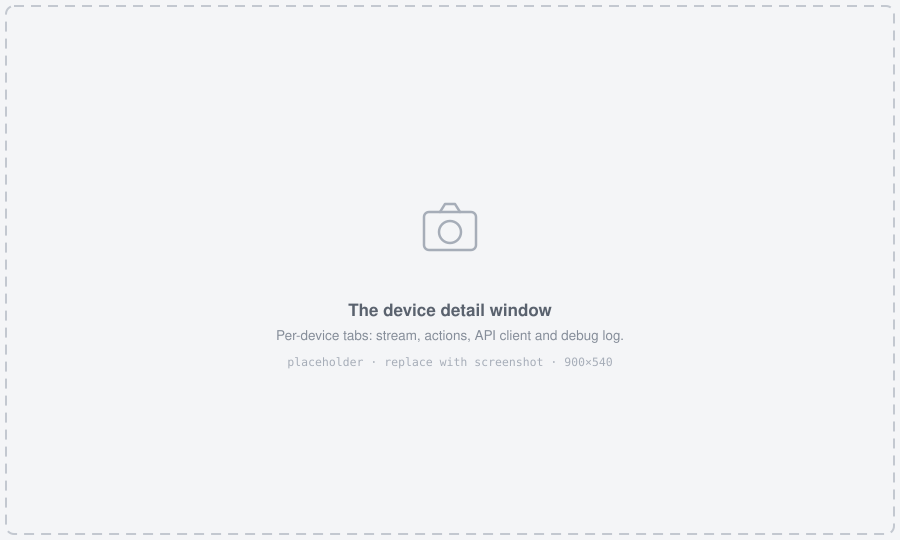
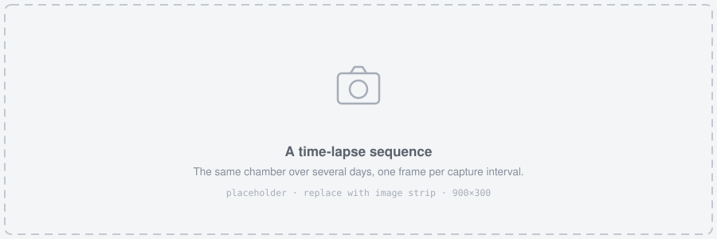

# User manual {#manual}

This chapter is written for the person running the experiment. It assumes no knowledge of the firmware, the network protocols or the code --- those are in Chapter \@ref(reference), and you can run a full experiment without ever opening that chapter.

## What a DWARPH experiment looks like {#experiment-shape}

A DWARPH device is a small growth chamber that looks after itself. You tell it what conditions to hold and how often to photograph the plants, and it does that unattended for days or weeks, saving every image and every measurement.

You describe the experiment in one file, called a **schedule**. A schedule says things like *"start at 16 °C in dim red light, warm to 25 °C by midday under full light, cool to 10 °C overnight, and repeat that for seven days, taking a picture every ten minutes."* You write that once, copy it to the device, and press start.

```{r device-photo, echo=FALSE, fig.cap="A DWARPH device. *(placeholder image)*"}

```

Because a single device is inexpensive, the platform is built on the assumption that you will run **several at once** --- replicates of a treatment, or several treatments side by side. Each device runs its own schedule independently; the dashboard on your laptop simply gives you one window onto all of them.

```{r fleet-photo, echo=FALSE, fig.cap="Several devices running side by side. Each holds its own conditions independently. *(placeholder image)*"}

```

## Before you start {#checklist}

You will need:

* One or more **assembled DWARPH devices** with firmware flashed (Chapter \@ref(build))
* An **SD card** in each device
* A **WiFi network** the devices can join, and a laptop on that same network
* The **GUI** installed on that laptop (Chapter \@ref(build))

One thing worth knowing before you design anything: **the device heats, but it does not actively cool.** It can hold a temperature above the room it sits in, and it reaches lower temperatures by simply not heating. In practice that means the coldest point in your schedule cannot go below the ambient temperature of the room, and a "night" of 10 °C is only achievable in a room that is already at or below 10 °C. Plan your room temperature around the *lowest* temperature your experiment needs.

<!-- TODO: confirm cooling behaviour with the hardware team, and give the real achievable range relative to ambient. -->

## Your first experiment {#first-experiment}

This walkthrough runs a short, simple experiment end to end. Do it once before designing anything real --- it takes about an hour and shakes out network and hardware problems while they are still cheap to fix.

1. **Put the plants in.** Set the chamber up as you would for a normal growth experiment, and make sure the camera's view of the water surface is unobstructed.

2. **Write a schedule.** Use the [schedule builder](schedule-builder.html) in Chapter \@ref(schedule-builder) --- it is a form that produces a valid file for you, and it will not let you make the common mistakes. For a first run, ask for something short: a two-hour cycle, one repeat, a picture every minute. You want to see it finish, not to learn anything biological from it.

3. **Set the WiFi details.** The device gets its network credentials *from the schedule file*, not from a settings menu. Fill in the network name and password in the builder. If you get these wrong the device will never appear on the network, and the only way to fix it is over USB or by editing the file on the SD card directly --- so check them carefully.

4. **Get the schedule onto the device.** Two ways:
   * *Over the network*, once the device is already on WiFi: in the GUI, open the device, go to the **Actions** tab, and use **Upload Schedule**.
   * *Directly on the card*, which is how the first schedule usually gets there: put the SD card in your computer and save the file as `<DEVICE_ID>/schedule.json`. Section \@ref(device-id) explains what `<DEVICE_ID>` is and where to find it.

5. **Power the device up.** It joins the WiFi network, sets its clock, and begins running the schedule. The small display on the device shows its status and current readings, so you can confirm it is alive without a computer.

6. **Open the GUI.** Devices appear on their own within a few seconds --- you do not have to enter addresses or scan for anything. Each device becomes a card showing its ID, current temperature and setpoint, light levels, uptime, scheduler state, and the most recent photograph.

```{r gui-grid, echo=FALSE, fig.cap="The dashboard. One card per device, updating live. *(placeholder screenshot)*"}

```

7. **Watch the first few cycles.** Check that the measured temperature actually converges on the setpoint, that the lights change when the schedule says they should, and that new images are arriving. This is the moment to catch a problem --- not on day six.

8. **Let it finish, then collect the images.** See Section \@ref(data).

If no device appears in step 6, jump to Section \@ref(troubleshooting) before changing anything.

## How devices are named {#device-id}

**You do not choose a device's name.** Each device derives its own identifier from its MAC address --- specifically the last six hexadecimal digits, in upper case --- so a device is called something like `8EF248`. It is fixed in the hardware, it survives reflashing, and it is unique across your fleet without you having to manage anything.

That identifier is used everywhere: the folder on the SD card, the name the device announces on the network (`dwarph-8EF248`), and the topic it publishes telemetry on. Label your physical chambers with it, or you will spend the experiment guessing which box is which.

To find a device's ID: read it off the device's own display, look at the card in the dashboard, or ask the device directly at `/api/id`.

### The `deviceID` field is a safety catch, not a name {-}

This is the part that surprises people. The `deviceID` field in a schedule file does **not** set the device's name. It says *which device this schedule is allowed to run on*, and the firmware checks it on load:

* If it matches the device's own ID **exactly** --- the comparison is case-sensitive, so use upper case --- the schedule is accepted.
* If it is the wildcard `"all"` --- this one is case-insensitive --- the schedule is accepted by any device.
* Anything else and **the schedule is rejected**, and the device will not run it.

This exists to stop you from uploading device A's treatment onto device B by accident, which in a multi-device experiment is a genuinely easy mistake to make and an expensive one to discover a week later.

So, in practice:

* Writing **one schedule for a whole fleet** --- all replicates of one treatment, or a pilot run --- set `deviceID` to `"all"`.
* Writing **per-device schedules**, because different chambers get different treatments --- set each file's `deviceID` to that chamber's actual ID. The check is then doing exactly the job it was designed for.

If a device silently refuses to start a schedule you just uploaded, a mismatched `deviceID` is the first thing to check; the reason appears in its log.

## Understanding schedules {#schedules}

A schedule is a list of **setpoints**. A setpoint is one moment in the day with the conditions you want at that moment: a time, a temperature, and a brightness for each of the three light channels.

By default the device does *not* jump between setpoints. It **interpolates** --- it moves gradually from one to the next, so that if you ask for 16 °C at 06:00 and 25 °C at 12:00, then at 09:00 the device targets roughly 20.5 °C. This is why a natural-looking day needs only four or five setpoints rather than one per hour: you are drawing the corners of the curve and letting the device fill in between them.

You can choose how it fills in the gaps:

* `linear` --- straight lines between setpoints. The sensible default.
* `cubic` --- a smooth curve (a Hermite spline) that eases in and out of each setpoint, if you want to avoid the sharp corners a linear ramp makes at dawn and dusk.
* `step` --- no interpolation at all: conditions change instantly at each setpoint and hold. Use this when you want a square-wave photoperiod rather than a simulated sunrise.

```{r schedule-plot, echo=FALSE, fig.cap="Temperature and the three light channels over one cycle. The device moves smoothly between the setpoints you define. *(placeholder figure)*"}

```

Three settings then control the shape of the experiment as a whole:

* **Cycle length** (`loopTime`) --- how long one repeat lasts. Use 24 hours for a normal day/night cycle. Shorter or longer cycles are perfectly possible if that is what you are studying.
* **Time unit** (`timeUnit`) --- whether the numbers in the schedule are `hours`, `minutes` or `seconds`. Hours is natural for a daily cycle; switch to minutes or seconds when you want fine detail, such as a brief light pulse.
* **Number of repeats** (`totalLoops`) --- how many cycles to run before stopping. Seven 24-hour cycles is a week-long experiment. Set it to `-1` to repeat indefinitely, for a chamber you intend to leave running until you stop it by hand.
* **Imaging interval** (`imageIntervalMin`) --- minutes between photographs.

### Choosing an imaging interval {-}

The interval sets how much temporal detail you get, and how much data you have to handle. Duckweed growth is slow, so intervals of the order of minutes to tens of minutes are usually plenty; capturing every minute over a week produces about ten thousand images per device and mostly tells you the same thing that every ten minutes would.

Bear in mind that images accumulate on the SD card and that a full card ends the recording, so pick the largest interval that still resolves what you care about, and check the card has room for the whole run before you start.

<!-- TODO: give the typical image file size and a table of card capacity vs. interval and run length. -->

### Light channels {-}

Brightness is set separately for **red**, **blue** and **white**, each on a scale from 0 (off) to 1 (full). Darkness is all three at 0. Note that these are *drive levels*, not photon flux --- if you need to report actual intensity, measure it with a light meter in the chamber rather than reporting the numbers from the schedule.

<!-- TODO: add a measured conversion from drive level to PPFD at plant level. -->

### Temperature limits {-}

The firmware refuses temperatures outside **10--50 °C**, whatever the schedule asks for. This is a safety limit on the hardware, not a suggestion. Combined with the no-active-cooling point in Section \@ref(checklist), the temperature range you can genuinely achieve is: no colder than the room, no colder than 10 °C, and no warmer than 50 °C.

### Three worked examples {-}

**Constant conditions.** Two setpoints with identical values, one at the start of the cycle and one at the end. Interpolating between two identical points holds a flat line, which is what you want for a control.

**A day/night cycle.** Four setpoints --- dawn, midday, dusk, night --- with light rising and falling and temperature tracking it. This is the common case, and the example the builder starts you with.

**A stress treatment.** Run the same daily cycle as your control for the first few days, then a cycle with a higher midday temperature for the remainder. Because each device runs its own file, the treatment device and the control device differ only in that one number, which makes the comparison clean.

### Absolute and relative time {-}

By default, times in the schedule are **relative**: hour 0 is when the device starts running the schedule. This is what you usually want, since it means the same file can be reused on any device on any day.

If you need several devices to be synchronised to real wall-clock time --- so that "midday" happens simultaneously across all of them --- use **absolute** times instead, given as `YYYY_MM_DD HH_mm_SS`. The devices synchronise their clocks over the network, so this works even though they were switched on at different moments.

Two things to watch with absolute time. It is interpreted as **UTC**, not your local time, so if you are anywhere other than the UK in winter you must offset your times by hand --- and remember that summer time will shift your experiment relative to the building's own lighting. And if you set `totalLoops` to anything other than 1, the date part is ignored and the schedule is treated as a 24-hour loop.

### Camera focus {-}

`focusMode` is set once for the whole schedule. `"Auto"` lets the camera focus itself before each capture, which is usually right. `"Manual"` fixes the focus at a position you give in `focusValue`, an integer from 0 (far) to 255 (close) --- worth using when autofocus keeps hunting between the water surface and the chamber wall, since a time-lapse where the focal plane drifts between frames is painful to analyse.

## Watching an experiment run {#running}

Once started, a device is autonomous: it keeps running the schedule, recording images and logging measurements whether or not your laptop is on, whether or not the GUI is open, and whether or not the WiFi is working. The dashboard is a window onto the experiment, not a part of it.

Opening a device from its card gives you:

* **Stream** --- live video from the chamber, with a **Record** button that saves it to a video file. Useful for checking framing and focus.
* **Actions** --- upload a new schedule, start, stop or reset the scheduler, restart the device, and manage the files on the SD card.
* **Debug** --- a running log, worth having open when something is misbehaving.

```{r gui-detail, echo=FALSE, fig.cap="The per-device window, with the live stream and the action controls. *(placeholder screenshot)*"}

```

Clicking the thumbnail on a card opens it fullscreen (`Esc` closes it) --- the quickest way to check that the plants look the way you expect.

You can filter the grid by keyword if you are running more devices than fit comfortably on screen.

If you have no hardware to hand and just want to see how the interface works, turn on **Mock Device** to get a demonstration card.

## Getting your data {#data}

Images and logs are written to the **SD card**, in a folder named after the device ID. The card is the authoritative copy: the thumbnails in the GUI are for monitoring, not for analysis.

```{r timelapse, echo=FALSE, fig.cap="The output of a run: one frame per capture interval, over the whole experiment. *(placeholder image)*"}

```

At the end of a run, take the card out and copy the folder off it. You can also pull files over the network through the GUI, which is convenient for spot-checks mid-experiment but slower for an entire run.

Keep the schedule file with the images. It is the record of what conditions the plants actually experienced, and in six months it will be the only thing that tells you what device `XYZABC` was doing.

<!-- TODO: document the log file format and the image file naming convention. -->

## When something goes wrong {#troubleshooting}

```{r, echo=FALSE}
df <- tibble::tribble(
  ~Symptom, ~"Most likely cause and fix",
  "No devices appear in the GUI at all", "Your laptop and the devices are on different networks, or the network blocks device discovery (common on university and guest WiFi). Try a simple router or a phone hotspot to confirm. Discovery runs automatically — there is no button to press.",
  "One device is missing, the others are fine", "Wrong WiFi name or password in that device's schedule file. The device cannot tell you this over a network it never joined — check its display, or connect it by USB.",
  "A card appears but the readings never update", "The live readings come from the optional telemetry service. If it is not set up, the card will look static — the device is still running normally. See Section \\@ref(mqtt).",
  "Temperature never reaches the setpoint", "Most often the target is below room temperature: the device cannot cool. Otherwise check the heater and that the lid is closed.",
  "Images are dark or out of focus", "Check the light channels are not all at 0 at that point in the schedule, and use the live stream to confirm framing and focus.",
  "New images stop partway through a run", "The SD card is full, or was removed. Check the free space before a long run.",
  "The schedule does not seem to have changed after upload", "Uploading a file does not restart a run in progress. Reset or restart the scheduler from the Actions tab."
)
knitr::kable(df)
```

If none of these fit, collect the device's debug log and open an issue --- see Chapter \@ref(community).
